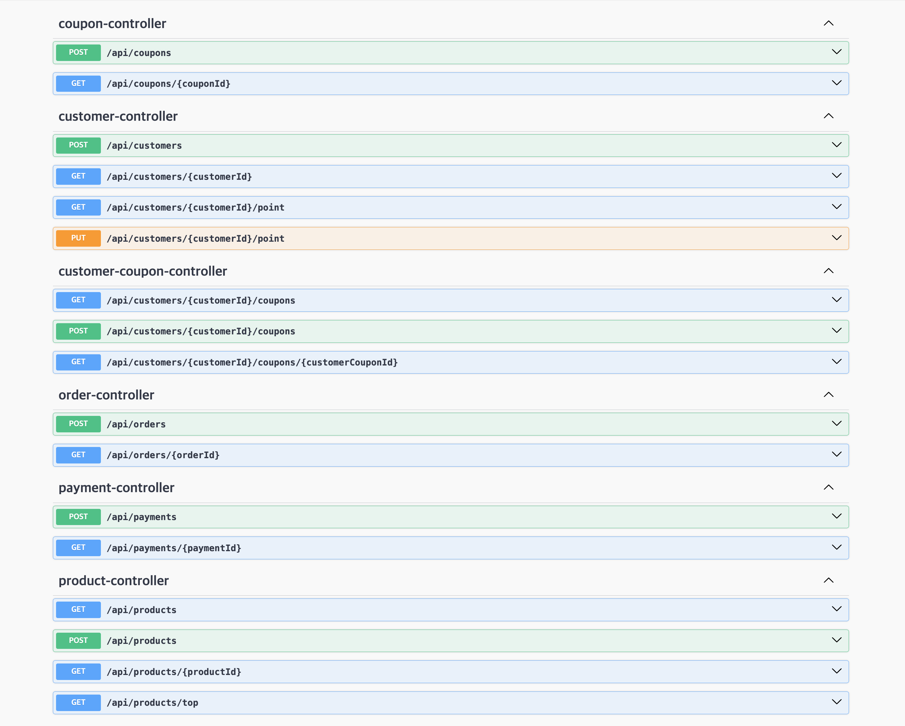

## 프로젝트


## Swagger


## 주요 기능 코드
### 주문 / 결제
- 주문 / 결제를 분리하였고 API도 분리해서 Front에서 주문생성 -> 결제요청 API를 연달아 호출하는 것을 생각하였습니다.
- 주문시에 쿠폰 / 상품재고를 구매 처리 합니다. 주문을 성공했는데 결제를 늦게해서(무통장입금처럼) 재고가 부족한 상황을 막기 위함입니다.
- 주문할 때 유저 -> 상품 순으로 Lock을 거는데 이는 많은 유저가 동시에 접근할 수 있는 상품에 Lock을 걸리는 시간을 최대한으로 줄이기 위함입니다.
- 주문과 주문상품이 따로 도메인으로 나뉘어 있지만 주문상품을 주문의 하위 도메인 처럼 다루고 싶어 주문상품의 생성로직을 주문도메인 안에 넣었습니다.
- 포인트는 결제시에 차감합니다.

### 쿠폰
- 선착순 쿠폰 발급시 Coupon에만 락을 걸어 재고가 없는데 발급되는 경우를 방지합니다.
- 한 유저가 여러개의 쿠폰을 발급받는 경우는 customer_id_coupon_id 인덱스를 unique = true로 생성하여 방지합니다.

## Getting Started

### Prerequisites

#### Running Docker Containers

`local` profile 로 실행하기 위하여 인프라가 설정되어 있는 Docker 컨테이너를 실행해주셔야 합니다.

```bash
docker-compose up -d
```


## Requirements
- 상품 주문에 필요한 메뉴 정보들을 구성하고 조회가 가능해야 합니다.
- 사용자는 상품을 여러개 선택해 주문할 수 있고, 미리 충전한 잔액을 이용합니다.
- 상품 주문 내역을 통해 판매량이 가장 높은 상품을 추천합니다.

## API Specs

1️⃣`주요` **잔액 충전 / 조회 API**

- 결제에 사용될 금액을 충전하는 API 를 작성합니다.
- 사용자 식별자 및 충전할 금액을 받아 잔액을 충전합니다.
- 사용자 식별자를 통해 해당 사용자의 잔액을 조회합니다.

2️⃣`기본` **상품 조회 API**

- 상품 정보 ( ID, 이름, 가격, 잔여수량 ) 을 조회하는 API 를 작성합니다.
- 조회시점의 상품별 잔여수량이 정확하면 좋습니다.

3️⃣`주요` **선착순 쿠폰 기능**

- 선착순 쿠폰 발급 API 및 보유 쿠폰 목록 조회 API 를 작성합니다.
- 사용자는 선착순으로 할인 쿠폰을 발급받을 수 있습니다.
- 주문 시에 유효한 할인 쿠폰을 함께 제출하면, 전체 주문금액에 대해 할인 혜택을 부여받을 수 있습니다.

4️⃣`주요` **주문 / 결제 API**

- 사용자 식별자와 (상품 ID, 수량) 목록을 입력받아 주문하고 결제를 수행하는 API 를 작성합니다.
- 결제는 기 충전된 잔액을 기반으로 수행하며 성공할 시 잔액을 차감해야 합니다.
- 데이터 분석을 위해 결제 성공 시에 실시간으로 주문 정보를 데이터 플랫폼에 전송해야 합니다. ( 데이터 플랫폼이 어플리케이션 `외부` 라는 가정만 지켜 작업해 주시면 됩니다 )

> 데이터 플랫폼으로의 전송 기능은 Mock API, Fake Module 등 다양한 방법으로 접근해 봅니다.


5️⃣`기본` **상위 상품 조회 API**

- 최근 3일간 가장 많이 팔린 상위 5개 상품 정보를 제공하는 API 를 작성합니다.
- 통계 정보를 다루기 위한 기술적 고민을 충분히 해보도록 합니다.

---


