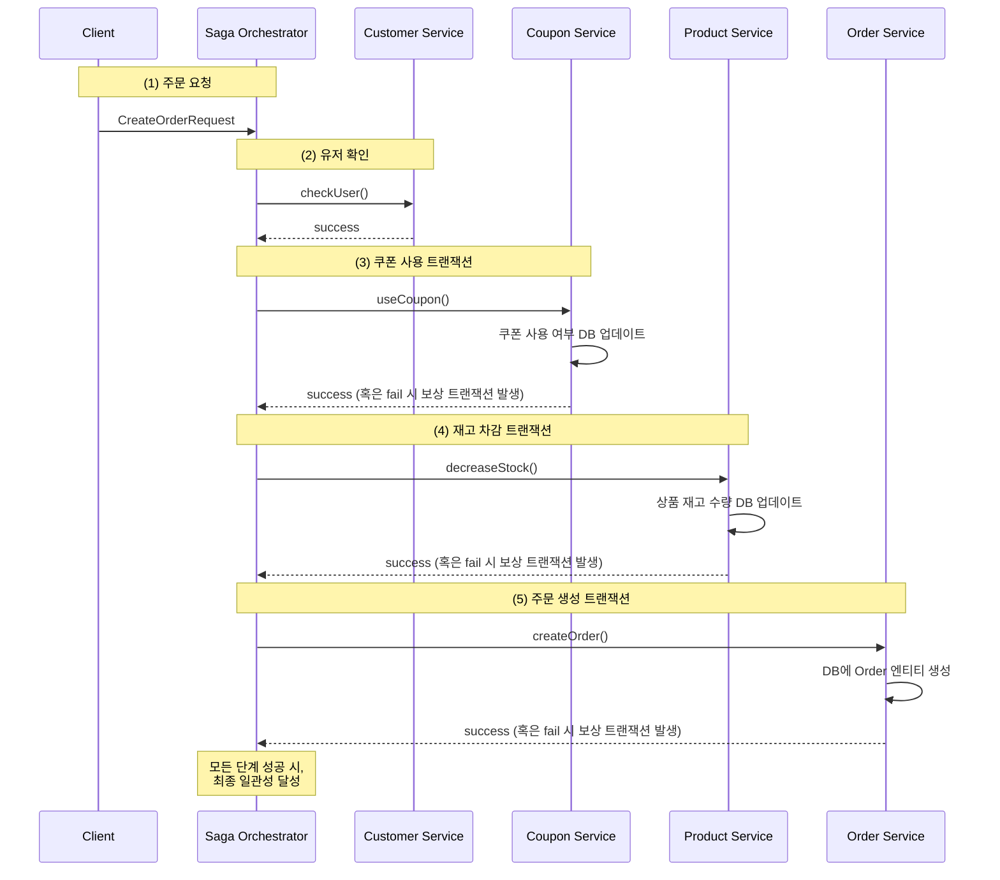

# MSA 전환에 따른 트랜잭션 처리

## 배경
- 기존에는 모놀리식(Monolithic) 구조로 모든 도메인이 하나의 프로젝트 안에서 실행되고, 하나의 DB에 연결됨
- `@Transactional`을 사용하여 하나의 트랜잭션으로 관리
- 내부 메서드 호출을 통해 여러 도메인 로직을 동일한 트랜잭션 범위로 처리
- 도메인별로 서버가 분리되면 하나의 트랜잭션으로 관리하기 어려움

## 분산 트랜잭션
**2개 이상의 시스템 간 트랜잭션을 처리하는 방식**

### ACID
#### 원자성 (Atomicity)
- 트랜잭션에 포함된 연산들이 모두 성공하거나 모두 실패해야 함
- 중간에 어떤 연산이 실패하면 전체 트랜잭션이 롤백되어 데이터가 이전 상태로 복구됨

#### 일관성 (Consistency)
- 트랜잭션 실행 전후로 데이터가 항상 유효한 상태를 유지해야 함

#### 고립성 (Isolation)
- 여러 트랜잭션이 동시에 실행될 때, 각 트랜잭션은 독립적으로 수행되어야 함
- 격리 레벨에 따라 어느 정도의 간섭이 허용될 수 있으나, 논리적으로는 독립적으로 보이도록 구현

#### 지속성 (Durability)
- 트랜잭션이 성공적으로 커밋된 후에는 시스템 장애가 발생해도 결과가 유지되어야 함

ACID는 단일 데이터베이스 환경에서는 비교적 쉽게 보장할 수 있지만, 여러 노드에서 동작하는 분산 환경에서는 네트워크 지연, 장애, 노드 간 충돌 등의 문제가 발생해 원자성, 고립성을 지키기 어려울 수 있음.

이를 해결하기 위해 **Two-Phase Commit(2PC)**, **SAGA 패턴** 등의 기법을 활용함.

### Two-Phase Commit (2PC)
**트랜잭션을 준비 단계와 커밋 단계로 나누어 처리하는 기법**

#### 처리 방식
1. 모든 관련 서비스가 커밋 준비를 수행하고, 준비 완료 여부를 트랜잭션 코디네이터(Transaction Coordinator)에 전달
2. 모든 서비스가 준비 완료되면 트랜잭션 코디네이터가 커밋을 요청하고 최종 적용
3. 서비스 중 하나라도 실패하면 트랜잭션 코디네이터가 롤백 요청을 수행

#### 한계
- Lock 유지 시간이 길어져 성능 저하 발생 가능
- 데드락 발생 가능성 증가
- 트랜잭션 코디네이터에 대한 의존성 증가

### SAGA 패턴
**여러 서비스의 로컬 트랜잭션을 순차적으로 실행하고, 실패 시 보상 트랜잭션을 수행하여 최종 데이터 정합성을 유지하는 기법**

#### 보상 트랜잭션
- 특정 단계에서 실패하면 이전까지 성공한 트랜잭션을 취소하는 보상 작업 수행
- 실제 롤백이 아닌, 롤백된 것처럼 처리하는 방식

#### Choreography 방식
- **이벤트 기반 트랜잭션 처리**
- 각 서비스는 로컬 트랜잭션 완료 후 이벤트를 발행
- 후속 작업을 맡은 서비스가 이벤트를 구독하고 자체 트랜잭션 수행
- 실패 시 보상 트랜잭션 이벤트 발행

##### 한계
- 이벤트 흐름이 복잡해질수록 트랜잭션 시퀀스 파악이 어려움
- 운영자가 트랜잭션의 현재 상태를 파악하기 어려움

#### Orchestration 방식
- **중앙에서 트랜잭션을 관리하는 매니저(SAGA 인스턴스) 추가**
- 각 서비스는 매니저의 지시에 따라 트랜잭션을 수행하고 결과를 반환
- 실패 시 매니저가 보상 트랜잭션 수행 요청

##### 한계
- 트랜잭션 매니저 서비스 추가로 인해 인프라 구현이 복잡해짐

## 트랜잭션 분리
**SAGA의 Orchestration 방식을 선택하는 것이 좋을 것 같다.**
- 2PC의 경우 여러 노드에 동시에 커밋을 해야하기 때문에 락을 동시에 건채로 유지해야 한다. 또한 네트워크 장애가 생길 경우 락이 길어질 수 있다.
- SAGA의 Choreograph 방식은 각 서비스가 이벤트 발행/구독을 통해 동작하므로, 한곳에서 전체 순서를 확인하기 어렵다.
- 여러 노드간 트랜잭션이 단계적으로 진행되고, 각 단계 실패 시 어떻게 복구할지가 분명한 구조라면, 오케스트레이션이 가독성과 유지보수 측면에서 유리해 보인다.
#### 기존 코드
https://github.com/FloralLife/server-kotlin/blob/9692e2ac6d4a81443796d0a8945dc3d10fb09a5b/src/main/kotlin/kr/hhplus/be/server/application/order/OrderUseCase.kt#L24-L58
```kotlin
@Transactional
fun order(command: CreateOrderUCCommand): OrderResult {
  val customer = customerService.get(command.customerId)

  val (customerCoupon, discountRate) =
    command.customerCouponId?.let {
      customerCouponService.get(it).let { coupon ->
        coupon to couponService.get(coupon.coupon.id).discountRate
      }
    } ?: (null to 0)

  if (customerCoupon != null) {
    customerCouponService.use(customerCoupon)
  }

  val products = productService.getAllWithLock(command.products.map { it.productId })
  val orderProducts = products.associateBy { it.id }
  val orderProductCommands =
    command.products.map { CreateOrderProductCommand(orderProducts[it.productId]!!, it.amount) }

  val order =
    orderService.create(
      CreateOrderCommand(
        address = command.address,
        customer = customer,
        customerCoupon = customerCoupon,
        discountRate = discountRate,
        products = orderProductCommands,
      ),
    )

  order.products.forEach { it.product.purchase(it.amount) }

  return order.toResult()
}
```

### 개선 방향

