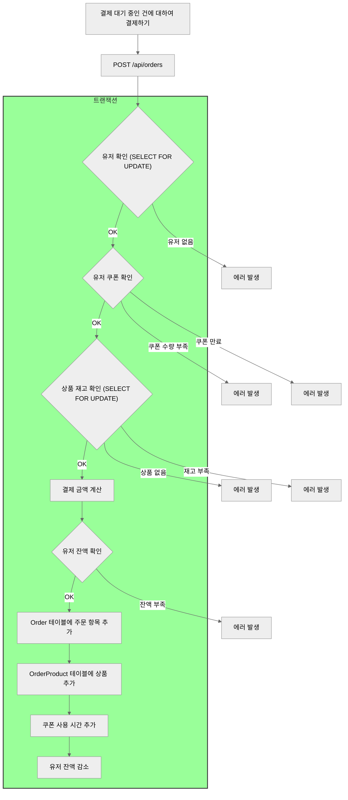
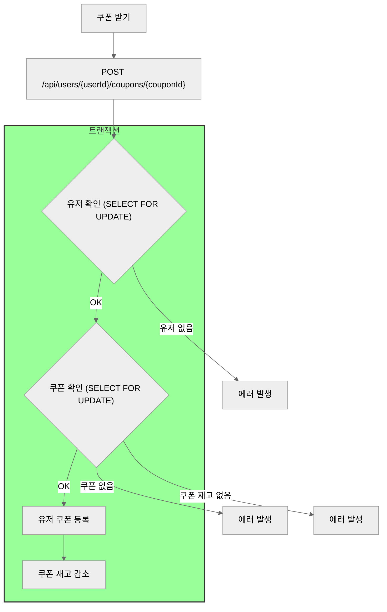

## 결제 
포인트를 바로 사용하는 현재의 서비스에서는 주문 / 결제를 합쳐놓았지만 추후에 외부 결제 API를 호출하게 된다면 분리할 듯 합니다.

```mermaid
%%{init: {'theme':'neutral'}}%%
flowchart TD
    click[결제 대기 중인 건에 대하여 결제하기] --> req["POST /api/orders"]
    req --> checkUser{"유저 확인 (SELECT FOR UPDATE)"}
    checkUser -- 유저 없음 --> userError[에러 발생]
    checkUser -- OK --> checkCoupon{"유저 쿠폰 확인"}
    checkCoupon -- 쿠폰 수량 부족 --> couponError[에러 발생]
    checkCoupon -- 쿠폰 만료 --> expirationError[에러 발생]
    checkCoupon -- OK --> checkStock{"상품 재고 확인 (SELECT FOR UPDATE)"}
    checkStock -- 상품 없음 --> productError[에러 발생]
    checkStock -- 재고 부족 --> stockError[에러 발생]
    checkStock -- OK --> calculateTotalPrice[결제 금액 계산]
    calculateTotalPrice --> checkBalance{유저 잔액 확인}
    checkBalance -- 잔액 부족 --> balanceError[에러 발생]
    checkBalance -- OK --> addOrder[Order 테이블에 주문 항목 추가]
    addOrder --> addOrderProduct[OrderProduct 테이블에 상품 추가]
    addOrderProduct --> updateCoupon[쿠폰 사용 시간 추가]
    updateCoupon --> decreaseBalance[유저 잔액 감소]

    subgraph transaction [트랜잭션]
        direction TB
        checkUser
        checkCoupon
        checkStock
        calculateTotalPrice
        checkBalance
        addOrder
        addOrderProduct
        updateCoupon
        decreaseBalance
    end

    style transaction fill:#9f9,stroke:#333,stroke-width:2px
```

---

## 선착순 쿠폰 발급

```mermaid
%%{init: {'theme':'neutral'}}%%
flowchart TB
    click["쿠폰 받기"] --> req["POST /api/users/{userId}/coupons/{couponId}"]
    req --> checkUser{"유저 확인 (SELECT FOR UPDATE)"}
    checkUser -- 유저 없음 --> userError[에러 발생]
    checkUser -- OK --> checkCoupon{"쿠폰 확인 (SELECT FOR UPDATE)"}
    checkCoupon -- 쿠폰 없음 --> couponError[에러 발생]
    checkCoupon -- 쿠폰 재고 없음 --> couponStockError[에러 발생]
    checkCoupon -- OK --> addUserCoupon[유저 쿠폰 등록]
    addUserCoupon --> decreaseCoupon[쿠폰 재고 감소]
    
    subgraph transaction [트랜잭션]
        direction TB
        checkUser
        checkCoupon
        addUserCoupon
        decreaseCoupon
    end

    style transaction fill:#9f9,stroke:#333,stroke-width:2px
```

