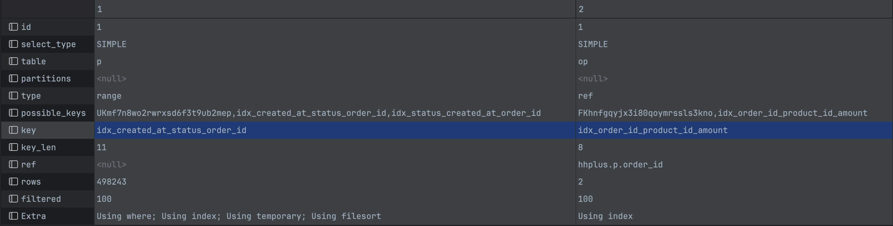

# 인덱스를 통한 쿼리 성능 개선

## 개념

테이블의 검색 속도를 향상시키기 위해 사용하는 자료구조로, 데이터와 데이터의 위치를 포함한 자료구조

### 원리

**MySQL의 스토리지 엔진 InnoDB에서는 B+Tree 구조로 인덱스를 저장한다.**

1. 인덱스에 명시된 컬럼의 값들을 기준으로 데이터를 B+Tree 자료 구조로 만들어 저장한다.
    a. 인덱스에는 명시된 컬럼들의 값과 실제 레코드 주소가 포함된다.
2. 인덱스를 통해 데이터를 조회할 때, 테이블을 모두 스캔하지 않고 인덱스를 조회하여 빠른 시간에 레코드의 위치를 찾는다.
3. 인덱스에 포함된 레코드 주소를 통해 실제 레코드 값을 반환한다.

#### B+Tree

- B-Tree와 마찬가지로 데이터를 찾는데 O(logN)의 시간이 걸림
- 리프 노드에만 데이터를 저장
- 리프 노드끼리 링크드 리스트로 연결되어 있어 범위 검색에 최적화


### 특징
- 테이블을 조회 속도 향상
  - 시스템 부하 감소
- 인덱스를 관리하기 위한 별도의 저장공간 필요
- 데이터 변경시 인덱스 구조도 변경해야 하는 추가작업 필요
- 인덱스를 통해 데이터를 조회할 경우 인덱스에 있는 레코드의 주소로 찾아가 레코드의 나머지 값들을 조회해야 하는데 이 작업이 많을수록 풀스캔 (실제 테이블에서 바로 조회) 보다 오래걸릴 수 있음
  - 인덱스의 카디널리티가 높을수록 유리

### 사용하기 좋은 경우
- 레코드의 변경이 자주 일어나지 않는 경우
- 테이블의 규모가 큰 경우
- 컬럼이 쿼리 조건으로 자주 사용될 경우
- 카디널리티가 높은 컬럼


## 성능 개선

### 배경
현재 서비스의 기능중 가장 복잡한 쿼리는 3일간 가장 많이 팔린 상품 5개 조회 쿼리이다.
이 기능은 서비스의 메인 페이지에서 사용될 확률이 높으므로 자주 호출되는 쿼리이다.

```sql
SELECT op.product_id, SUM(op.amount) AS total_amount
FROM payment p JOIN order_product op ON p.order_id = op.order_id
WHERE p.created_at >= ${ start_date }
  AND p.status = 'COMPLETED'
GROUP BY op.product_id
ORDER BY SUM(op.amount) DESC
LIMIT 5
```

또한 데이터가 100만건 정도 있을 때, 최근 3일간 가장 많이 팔린 상품을 조회시 평균 6590.8 ms 의 시간이 걸린다.

자주 사용되는 쿼리가 평균 6초 정도나 소요되기 때문에 성능 개선이 필요하다.
```
[2025-02-14 01:09:16] 5 rows retrieved starting from 1 in 8 s 759 ms (execution: 8 s 690 ms, fetching: 69 ms)

[2025-02-14 01:09:28] 5 rows retrieved starting from 1 in 7 s 100 ms (execution: 6 s 870 ms, fetching: 230 ms)

[2025-02-14 01:10:04] 5 rows retrieved starting from 1 in 6 s 670 ms (execution: 6 s 475 ms, fetching: 195 ms)

[2025-02-14 01:10:20] 5 rows retrieved starting from 1 in 6 s 266 ms (execution: 6 s 80 ms, fetching: 186 ms)

[2025-02-14 01:10:34] 5 rows retrieved starting from 1 in 6 s 264 ms (execution: 6 s 51 ms, fetching: 213 ms)

[2025-02-14 01:11:45] 5 rows retrieved starting from 1 in 6 s 425 ms (execution: 6 s 241 ms, fetching: 184 ms)

[2025-02-14 01:11:55] 5 rows retrieved starting from 1 in 6 s 197 ms (execution: 5 s 890 ms, fetching: 307 ms)

[2025-02-14 01:12:20] 5 rows retrieved starting from 1 in 6 s 28 ms (execution: 5 s 674 ms, fetching: 354 ms)

[2025-02-14 01:12:27] 5 rows retrieved starting from 1 in 5 s 818 ms (execution: 5 s 624 ms, fetching: 194 ms)

[2025-02-14 01:12:35] 5 rows retrieved starting from 1 in 6 s 381 ms (execution: 6 s 110 ms, fetching: 271 ms)
```

### 고려사항
- payment
  - status, created_at 조건으로 검색
  - order_id로 JOIN
- order_product
  - order_id로 JOIN
  - product_id로 GROUP BY
  - amount로 SUM & ORDER BY
- 다른 쿼리에서도 사용되는 컬럼

### 개선방법
- `payment` 에 `created_at`, `status` 복합인덱스로 필터링 속도 향상
  - `status`는 결제 완료 / 결제 취소 상태밖에 없고 대부분이 결제 완료 상태이기 때문에 카디널리티가 매우 낮다. 따라서 앞쪽에 두는것이 큰 의미가 없다고 판단
- `payment`의 위의 인덱스에 `order_id`까지 인덱스에 포함시키는 커버링 인덱스로 생성
- `order_product` 에서 `order_id`로 JOIN 이후에 `product_id`로 group by 를 수행하므로 `order_id`, `product_id` 복합인덱스 생성
- `amount` 까지 포함시키는 커버링 인덱스로 생성
- 이 쿼리에서 사용되는 조건들은 다른 기능쪽에선 거의 사용되지 않을 것으로 보이기 때문에 이 인덱스는 인기상품 조회만을 위한 인덱스이다.

### 개선결과
#### Explain

key 에 `payment` 에서는 `idx_created_at_status_order_id`, `order_product` 에서는 `idx_order_id_product_id, amount` 인덱스를 타는것을 확인했다.

#### 실행
```
[2025-02-14 01:39:58] 5 rows retrieved starting from 1 in 1 s 836 ms (execution: 1 s 492 ms, fetching: 344 ms)

[2025-02-14 01:39:59] 5 rows retrieved starting from 1 in 1 s 165 ms (execution: 972 ms, fetching: 193 ms)

[2025-02-14 01:40:00] 5 rows retrieved starting from 1 in 927 ms (execution: 767 ms, fetching: 160 ms)

[2025-02-14 01:40:01] 5 rows retrieved starting from 1 in 920 ms (execution: 746 ms, fetching: 174 ms)

[2025-02-14 01:40:02] 5 rows retrieved starting from 1 in 911 ms (execution: 750 ms, fetching: 161 ms)

[2025-02-14 01:40:03] 5 rows retrieved starting from 1 in 903 ms (execution: 838 ms, fetching: 65 ms)

[2025-02-14 01:40:04] 5 rows retrieved starting from 1 in 912 ms (execution: 729 ms, fetching: 183 ms)

[2025-02-14 01:40:05] 5 rows retrieved starting from 1 in 905 ms (execution: 843 ms, fetching: 62 ms)

[2025-02-14 01:40:06] 5 rows retrieved starting from 1 in 960 ms (execution: 727 ms, fetching: 233 ms)

[2025-02-14 01:40:07] 5 rows retrieved starting from 1 in 898 ms (execution: 703 ms, fetching: 195 ms)

[2025-02-14 01:40:07] 5 rows retrieved starting from 1 in 919 ms (execution: 743 ms, fetching: 176 ms)

[2025-02-14 01:40:08] 5 rows retrieved starting from 1 in 920 ms (execution: 807 ms, fetching: 113 ms)
```

평균 소요시간 1014.7 ms 로 속도가 향상된 것을 확인하였다. 
